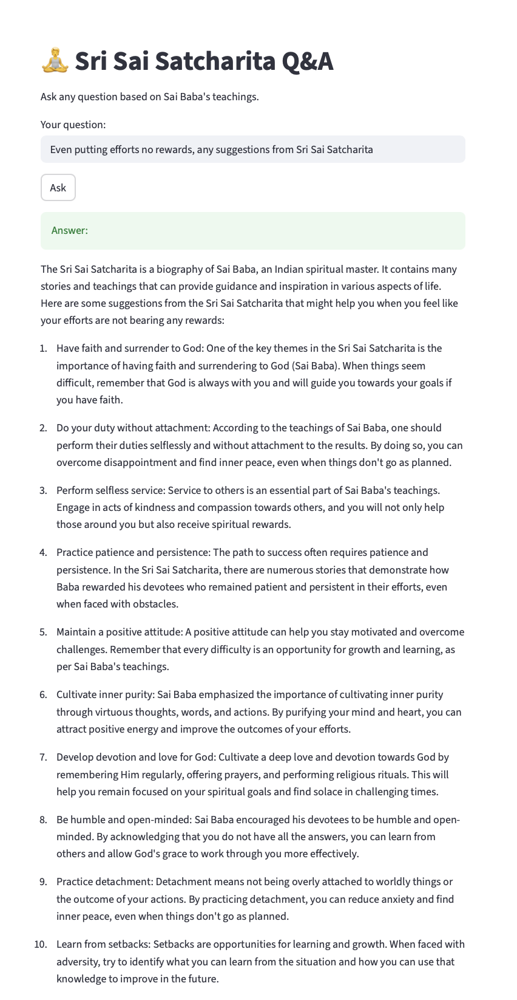

### Chat with Sri Sai Chatcharita

This repository comprises of python scripts which has been built to create a LLM based application. With simple text chat to get the guidance from the footprints of the great spiritual leader Shirdi Sai Baba.

The source is based on the english version of Sri Sai Chatcharita (All Chapters)

Think of a situtation and then you can ask any question and the responses are always undeterminstic but will be more close to your situations miraclously.

Note: Ask questions in more detailed way for much relevant answers

### Prompt: 
`Even putting efforts no rewards, any suggestions from Sri Sai Satcharita`

### Response: 

| Process | Tech Spec |
| :--- | :---: |
| Pdf to Text | Python inbulit lib |
| Docloader | Langchain Docloader |
| Embeddings | HuggingFace |
| Vector Store | ChromaDB |
| LLM | Ollama |
| UI | Streamlit |

